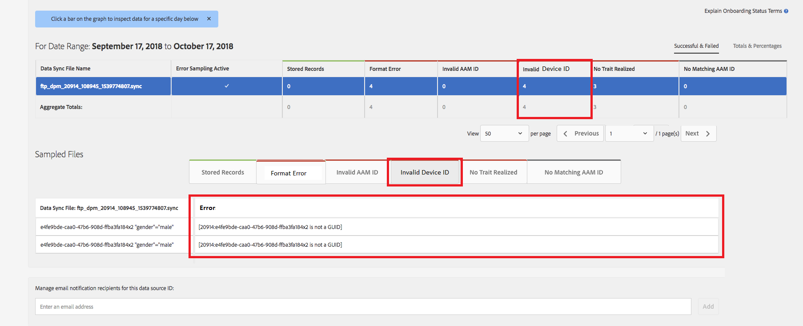

# Convalida ID dispositivo globale {#global-device-id-validation}

Device Advertising Identifiers (cioè iDFA, GAID, Roku ID) hanno standard di formattazione che devono essere soddisfatti per essere utilizzabili nell&#39;ecosistema di pubblicità digitale. Oggi, i clienti e i partner possono caricare gli ID nel nostro [!UICONTROL data sources] globale in qualsiasi formato senza ricevere alcuna notifica relativa al corretto formattazione dell’ID. Questa funzione introdurrà la convalida degli ID dispositivo inviati al Globale [!UICONTROL data sources] per la corretta formattazione e fornirà messaggi di errore quando gli ID sono formattati in modo errato. Al momento del lancio sarà supportata la convalida per [!DNL iDFA], [!DNL Google Advertising] e [!DNL Roku IDs].

## Panoramica degli standard di formato {#overview-of-format-standards}

Di seguito sono riportati i pool di ID di Device Advertising globali attualmente riconosciuti e supportati da AAM. Queste vengono implementate come [!UICONTROL Data Sources] condivise che possono essere utilizzate da qualsiasi cliente o partner di dati che lavora con dati legati agli utenti di queste piattaforme.

<table>
  <tr>
   <td>Piattaforma </td>
   <td>ID origine dati AAM </td>
   <td>Formato ID </td>
   <td>PID AAM </td>
   <td>Note </td>
  </tr>
  <tr>
   <td>Google Android (GAID)</td>
   <td>20914</td>
   <td>32 numeri esadecimali, generalmente presentati come 8-4-4-4-12<em>esempio, 97987bca-ae59-4c7d-94ba-ee4f19ab8c21  </em> </td>
   <td>1352</td>
   <td>Questo ID deve essere raccolto in un modulo non elaborato/non con hash/non modificato Riferimento - <a href="https://play.google.com/about/monetization-ads/ads/ad-id/">https://play.google.com/about/monetization-ads/ads/ad-id/</a></td>
  </tr>
  <tr>
   <td>Apple iOS (IDFA)</td>
   <td>20915</td>
   <td>32 numeri esadecimali, generalmente presentati come 8-4-4-12 <em>esempio, 6D92078A-8246-4BA4-AE5B-76104861E7DC  </em> </td>
   <td>3560</td>
   <td>Questo ID deve essere raccolto in un modulo non elaborato/non con hash/non modificato Riferimento - <a href="https://support.apple.com/en-us/HT205223">https://support.apple.com/en-us/HT205223</a></td>
  </tr>
  <tr>
   <td>Roku (RIDA)</td>
   <td>121963</td>
   <td>32 numeri esadecimali, generalmente presentati come 8-4-4-12 <em>esempio,</em> <em>fcb2a29c-315a-5e6b-bcfd-d889ba19aada</em></td>
   <td>11536</td>
   <td>Questo ID deve essere raccolto in un modulo non elaborato/non con hash/non modificato Riferimento - <a href="https://sdkdocs.roku.com/display/sdkdoc/Roku+Advertising+Framework">https://sdkdocs.roku.com/display/sdkdoc/Roku+Advertising+Framework</a> </td>
  </tr>
  <tr>
   <td>ID pubblicità Microsoft (MAID)</td>
   <td>389146</td>
   <td>Stringa numerica alfa</td>
   <td>14593</td>
   <td>Questo ID deve essere raccolto in un modulo non elaborato/non con hash/non modificato Riferimento - <a href="https://docs.microsoft.com/en-us/uwp/api/windows.system.userprofile.advertisingmanager.advertisingid">https://docs.microsoft.com/en-us/uwp/api/windows.system.userprofile.advertisingmanager.advertisingid</a> <a href="https://msdn.microsoft.com/en-us/library/windows/apps/windows.system.userprofile.advertisingmanager.advertisingid.aspx">https://msdn.microsoft.com/en-us/library/windows/apps/windows.system.userprofile.advertisingmanager.advertisingid.aspx</a></td>
  </tr>
  <tr>
   <td>Samsung DUID</td>
   <td>404660</td>
   <td>Esempio di stringa numerica alfa, 7XCBNROQJQPYW</td>
   <td>15950</td>
   <td>Questo ID deve essere raccolto in un modulo non elaborato/non con hash/non modificato Riferimento - <a href="https://developer.samsung.com/tv/develop/api-references/samsung-product-api-references/productinfo-api">https://developer.samsung.com/tv/develop/api-references/samsung-product-api-references/productinfo-api</a> </td>
  </tr>
</table>

## Impostazione di un identificatore pubblicitario nell&#39;app {#setting-an-advertising-identifier-in-the-app}

L’impostazione dell’ID inserzionista nell’app è in realtà un processo in due fasi: prima recupera l’ID dell’inserzionista e poi lo invia all’Experience Cloud. Di seguito sono riportati i collegamenti che consentono di eseguire questi passaggi.

1. Recupera l&#39;ID
   1. [!DNL Apple] le informazioni sul  [!DNL advertising ID] sono disponibili  [QUI](https://developer.apple.com/documentation/adsupport/asidentifiermanager).
   1. Per ulteriori informazioni sull&#39;impostazione di [!DNL advertiser ID] per gli sviluppatori [!DNL Android], consulta [HERE](http://www.androiddocs.com/google/play-services/id.html).
1. Invialo nell’Experience Cloud utilizzando il metodo [!DNL setAdvertisingIdentifier] nell’SDK
   1. Le informazioni per l&#39;utilizzo di `setAdvertisingIdentifier` si trovano nella [documentazione](https://aep-sdks.gitbook.io/docs/using-mobile-extensions/mobile-core/identity/identity-api-reference#set-an-advertising-identifier) sia per [!DNL iOS] che per [!DNL Android].

`// iOS (Swift) example for using setAdvertisingIdentifier:`
`ACPCore.setAdvertisingIdentifier([AdvertisingId]) // ...where [AdvertisingId] is replaced by the actual advertising ID`

## Messaggi di errore DCS per ID errati {#dcs-error-messaging-for-incorrect-ids}

Quando un ID dispositivo globale non corretto (IDFA, GAID, ecc.) viene inviato in tempo reale ad Audience Manager, viene restituito un codice di errore sull&#39;hit. Di seguito è riportato un esempio di errore restituito perché l’ID viene inviato come [!DNL Apple IDFA], che deve contenere solo lettere maiuscole e tuttavia è presente una lettera &#39;x&#39; minuscola nell’ID.

Consulta la [documentazione](https://experienceleague.adobe.com/docs/audience-manager/user-guide/api-and-sdk-code/dcs/dcs-api-reference/dcs-error-codes.html?lang=en#api-and-sdk-code) per l&#39;elenco dei codici di errore.

## ID dispositivo globale di onboarding {#onboarding-global-device-ids}

Oltre all&#39;invio in tempo reale degli ID dispositivo globale, puoi anche caricare i dati &quot;[!DNL onboard]&quot; (caricare) anche rispetto agli ID. Questo processo è lo stesso dell’onboarding dei dati sugli ID cliente (in genere tramite coppie chiave/valore), ma utilizzeresti semplicemente gli ID sorgente dati appropriati, in modo che i dati vengano assegnati all’ID dispositivo globale. La documentazione sul processo di onboarding si trova nella [documentazione](https://experienceleague.adobe.com/docs/audience-manager/user-guide/implementation-integration-guides/sending-audience-data/batch-data-transfer-process/batch-data-transfer-overview.html?lang=en#implementation-integration-guides). Ricordati di usare l’ [!UICONTROL data source] ID globale, a seconda della piattaforma in uso.

Se tramite il processo di onboarding vengono inviati ID dispositivo globale non corretti, gli errori verranno visualizzati in [[!DNL Onboarding Status Report]](https://experienceleague.adobe.com/docs/audience-manager/user-guide/reporting/onboarding-status-report.html?lang=en#reporting).

Di seguito è riportato un esempio di errore che potrebbe verificarsi nel rapporto:

