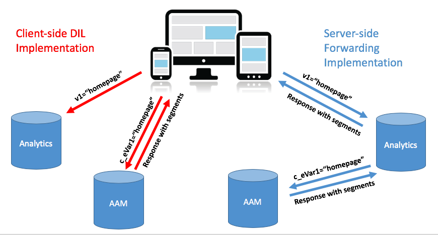
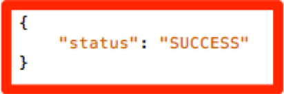

# Migrazione dell’implementazione AAM del sito da [!DNL Client-Side] DIL a [!DNL Server-Side Forwarding] {#migrating-your-site-s-aam-implementation-from-client-side-dil-to-server-side-forwarding}

Questa esercitazione si applica agli utenti che dispongono sia di Adobe Audience Manager (AAM) che di Adobe Analytics e che attualmente inviano un hit dalla pagina a AAM utilizzando il codice &quot;DIL&quot; ([!DNL Data Integration Library]) e inviando anche un hit dalla pagina ad Adobe Analytics. Poiché entrambe le soluzioni sono in tuo possesso e poiché entrambe fanno parte di Adobe Experience Cloud, puoi seguire la best practice per attivare &quot;[!DNL Server-Side Forwarding] (SSF)&quot;, che consente ai [!DNL Analytics] server di raccolta dati di inoltrare i dati analitici del sito in tempo reale ad Audience Manager, invece di far sì che il codice [!DNL client-side] invii un hit aggiuntivo dalla pagina a AAM. Questa esercitazione ti guiderà attraverso i passaggi necessari per passare dalla precedente implementazione &quot;[!DNL Client-Side DIL]&quot; al più recente metodo &quot;[!DNL Server-Side forwarding]&quot;.

## [!DNL Client-Side] (DIL) vs.  [!DNL Server-Side] {#client-side-dil-vs-server-side}

Quando si confrontano e si confrontano questi due metodi per ottenere i dati di Adobe Analytics in AAM, può essere prima utile visualizzare le differenze nell’immagine seguente:

### [!DNL Client-side] Implementazione di DIL  {#client-side-dil-implementation}

Se utilizzi questo metodo per ottenere i dati di Adobe Analytics in AAM, significa che due hit provengono dalle pagine Web: Uno che va a [!DNL Analytics] e uno che va a AAM (dopo aver copiato i dati [!DNL Analytics] sulla pagina Web. [!UICONTROL Segments] vengono restituiti da AAM alla pagina, dove possono essere utilizzati per la personalizzazione, ecc. Questa operazione è considerata un’implementazione &quot;legacy&quot; e non è più consigliata.

Oltre al fatto che questo non è conforme alle best practice, gli svantaggi di utilizzare questo metodo includono:

* Due hit provenienti dalla pagina invece di uno solo
* [!UICONTROL Server-Side Forwarding] è necessario per la condivisione in tempo reale di tipi di pubblico su  [!DNL Analytics], pertanto  [!DNL Client-side] le implementazioni non consentono questa funzione (e potenzialmente altre funzionalità in futuro)

È consigliabile passare a un metodo di implementazione [!UICONTROL Server-Side Forwarding] AAM.

### [!UICONTROL Server-Side Forwarding] Implementazione {#server-side-forwarding-implementation}

Come mostrato nell&#39;immagine precedente, un hit viene dalla pagina web ad Adobe Analytics. [!DNL Analytics] poi inoltra quei dati a AAM in tempo reale, e i visitatori vengono valutati in AAM  [!UICONTROL traits] e  [!UICONTROL segments], proprio come se l&#39;hit fosse venuto direttamente dalla pagina.

[!UICONTROL Segments] vengono restituiti sullo stesso hit in tempo reale a  [!DNL Analytics], che inoltra la risposta sulla pagina web per la personalizzazione, ecc.

Il passaggio a Server-Side Forwarding non comporta alcun rallentamento. Si consiglia vivamente a tutti coloro che dispongono sia di Audienci Manager che di [!DNL Analytics] di utilizzare questo metodo di implementazione.

## Hai due attività principali {#you-have-two-main-tasks}

C&#39;è un bel po&#39; di informazioni su questa pagina, ed è tutto importante, naturalmente. Tuttavia, **tutto si riduce a due cose principali che è necessario fare**:

1. Cambia il codice da [!DNL Client-Side] codice DIL a [!UICONTROL Server-Side Forwarding] codice
1. Invertire l&#39;interruttore in [!DNL Analytics] [!DNL Admin Console] per avviare l&#39;effettivo inoltro dei dati (per [!UICONTROL report suite])

Se salti uno di questi due, SSF non funzionerà correttamente. Sono stati aggiunti passaggi e dati aggiuntivi a questo documento per aiutarti a eseguire correttamente questi due passaggi per la configurazione.

## Opzioni di implementazione {#implementation-options}

Mentre passi da [!DNL client-side] a [!DNL server-side], una delle attività che avrai sarà quella di modificare il codice nel nuovo codice [!UICONTROL Server-Side Forwarding]. Questa operazione viene eseguita utilizzando una delle seguenti opzioni:

* Adobe Experience Platform Launch: opzione di implementazione consigliata per le proprietà Web. Vedrai che questo è un compito molto facile, come [!DNL Launch] ha fatto tutte le cose difficili per te.
* Nella pagina - Puoi anche inserire il nuovo codice SSF direttamente nella funzione `doPlugins` all&#39;interno del file [!DNL appMeasurement.js], se non lo sei (ancora) utilizzando Adobe Launch
* Altri gestori di tag : questi possono essere trattati come l’opzione precedente (Sulla pagina), in quanto il codice SSF verrà comunque inserito in `doPlugins`, ovunque l’altro gestore di tag memorizzi il codice [!DNL AppMeasurement]

Esamineremo ciascuno di questi elementi nella sezione Aggiornamento del codice .

## Passaggi di implementazione {#implementation-steps}

### Passaggio 0: Prerequisito: Servizio Experience Cloud ID (ECID) {#step-prerequisite-experience-cloud-id-service-ecid}

Il prerequisito principale per lo spostamento a [!UICONTROL Server-Side Forwarding] è l’implementazione del servizio Experience Cloud ID. Questo viene fatto molto facilmente se si utilizza Experience Platform Launch, nel qual caso si installa semplicemente l&#39;estensione ECID e farà il resto.

Se utilizzi un TMS non Adobe o nessun TMS, implementa ECID per eseguire **before** qualsiasi altra soluzione di Adobe. Per ulteriori informazioni, consulta la [documentazione ECID](https://marketing.adobe.com/resources/help/en_US/mcvid/) . L’unico altro prerequisito riguarda le versioni del codice, in modo da applicare semplicemente le versioni più recenti del codice nei passaggi seguenti, sarà bene.

>[!NOTE]
>
>Leggere l&#39;intero documento prima di implementarlo. La sezione &quot;Tempimento&quot; riportata di seguito contiene informazioni importanti su *quando* devi implementare ogni pezzo, incluso ECID (se non è ancora implementato).

### Passaggio 1: Record Opzioni attualmente utilizzate dal codice DIL {#step-record-currently-used-options-from-dil-code}

Quando ti prepari a passare da [!DNL Client-Side] codice DIL a [!UICONTROL Server-Side Forwarding], il primo passaggio consiste nell’identificare tutte le operazioni che esegui con il codice DIL, incluse le impostazioni personalizzate e i dati inviati a AAM. Gli aspetti da considerare e da considerare includono:

* Variabili normali [!DNL Analytics], utilizzando il modulo [!DNL siteCatalyst.init] DIL - Non dovrai preoccuparti di questo, perché il suo lavoro è solo quello di inviare le normali variabili [!DNL Analytics], e ciò avverrà in virtù della semplice abilitazione di SSF.
* Sottodominio partner - Nella funzione DIL.create , annota il parametro `partner` . Questo è noto come &quot;sottodominio partner&quot; o talvolta come &quot;ID partner&quot; e sarà necessario quando inserisci il nuovo codice SSF.
* [!DNL Visitor Service Namespace] - Noto anche come &quot;[!DNL Org ID]&quot; o &quot;[!DNL IMS Org ID]&quot;, questo è necessario anche quando imposti il nuovo codice SSF. Prendetene nota.
* containerNSID, uuidCookie e altre opzioni avanzate - Prendi nota di eventuali opzioni avanzate aggiuntive che stai utilizzando in modo da poterle impostare anche nel codice SSF.
* Variabili di pagina aggiuntive - Se altre variabili vengono inviate a AAM dalla pagina (oltre alle normali variabili [!DNL Analytics] gestite da siteCatalyst.init), sarà necessario prenderne nota in modo che possano essere inviate tramite SSF (spoiler alert: tramite variabili [!DNL contextData]).

### Passaggio 2: Aggiornamento del codice {#step-updating-the-code}

Nella sezione sopra intitolata &quot;Opzioni di implementazione&quot;, sono fornite più opzioni relative a come/dove stai implementando [!UICONTROL Server-Side Forwarding]. Affinché questa sezione sia efficace, dobbiamo suddividerla in queste sezioni (con due di esse combinate). Vai al metodo di questa sezione che descrive meglio le tue esigenze.

#### Adobe Experience Platform Launch {#launch-by-adobe}

Guarda il video seguente per scoprire come spostare le opzioni di implementazione dal codice DIL in [!UICONTROL Server-Side Forwarding] nel Experience Platform Launch .[!DNL Client-Side]

>[!VIDEO](https://video.tv.adobe.com/v/26310/?quality=12)

#### &quot;Sulla pagina&quot; o non-Adobe Tag Manager {#on-the-page-or-non-adobe-tag-manager}

Guarda il video seguente per scoprire come spostare le opzioni di implementazione dal codice DIL in [!UICONTROL Server-Side Forwarding] nel codice [!DNL AppMeasurement], che risiede in un file o in un sistema di gestione tag non Adobe.[!DNL Client-Side]

>[!VIDEO](https://video.tv.adobe.com/v/26312/?quality=12)

### Passaggio 3: Abilitazione dell&#39;inoltro (per [!UICONTROL Report Suite]) {#step-enabling-the-forwarding-per-report-suite}

Finora in questa esercitazione abbiamo trascorso tutto il nostro tempo nel passare dal codice [!DNL Client-Side DIL] a [!UICONTROL Server-Side Forwarding]. Va bene, perché è la parte più difficile. Questa sezione, anche se è super facile, è importante quanto l&#39;aggiornamento del codice. Questo video illustra come capovolgere l’interruttore che consente l’effettivo inoltro dei dati da Analytics ad Audience Manager.

>[!VIDEO](https://video.tv.adobe.com/v/26355/?quality-12)

**NOTA:** come indicato nel video, ricorda che ci vorranno fino a 4 ore perché l&#39;abilitazione dell&#39;inoltro venga implementata completamente sul backend Experience Cloud.

## Tempi {#timing}

Come promemoria, ci sono due attività principali da spostare da [!DNL Client-Side DIL] a [!UICONTROL Server-Side Forwarding]:

1. Aggiornamento del codice
1. Capovolgimento dell&#39;interruttore in [!DNL Analytics] [!DNL Admin Console]

Ma la domanda è, quale fai prima? Importa? Ok, scusate, erano due domande. Ma le risposte sono... dipende, e sì, può *può* essere importante. Com&#39;è vago? Distruggiamola. Ma prima una domanda aggiuntiva che può venire fuori se siete una grande organizzazione con molti siti: Devo fare tutto immediatamente? Quella è un po&#39; più facile. No. Puoi farlo pezzo per pezzo... una specie. :

### Una piccola immersione più profonda {#a-little-deeper-dive}

Il motivo per cui la tempistica e la materia dell&#39;ordine sono dovuti al funzionamento di avanzamento *realmente *, che può essere riassunto nei seguenti alcuni fatti tecnici:

* Se hai implementato il servizio Experience Cloud ID (ECID) e l&#39;interruttore in [!DNL Analytics] [!DNL Admin Console] (&quot;l&#39;interruttore&quot;) è attivato, i dati verranno inoltrati da [!DNL Analytics] a AAM, anche se non hai ancora aggiornato il codice.
* Se non hai implementato ECID, i dati non verranno inoltrati, anche se hai attivato l’interruttore, e disponi del codice SSF.
* Il codice SSF (sia in [!DNL Launch] che sulla pagina) gestisce davvero la risposta ed è ovviamente necessario per completare la migrazione.
* Ricorda che l’interruttore SSF è abilitato da [!UICONTROL Report Suite], ma che il codice è gestito dalla proprietà in [!DNL Launch], o dal file [!DNL AppMeasurement] se non utilizzi [!DNL Launch]

### Best practice {#best-practices}

Sulla base di questi dettagli tecnici, ecco le raccomandazioni per la tempistica di &quot;cosa fare quando&quot;:

#### Se NON hai ancora implementato ECID {#if-you-do-not-have-ecid-yet-implemented}

1. Capovolgi l&#39;interruttore in [!DNL Analytics] per ogni [!UICONTROL report suite] che verrà attivato per SSF

   1. L&#39;inoltro non verrà ancora avviato perché non disponi di ECID

1. Per sito, aggiorna il codice da [!DNL Client-Side DIL] a SSF (potrebbe essere in [!DNL Launch] o sulla pagina, come descritto in un&#39;altra sezione precedente)

   1. L’inoltro ora scorrerà (come hai aggiunto ECID) e dovresti anche ricevere una risposta JSON corretta al beacon [!DNL Analytics] (consulta la sezione Convalida e risoluzione dei problemi di seguito per ulteriori dettagli).

#### Se ECID è implementato {#if-you-do-have-ecid-implemented}

1. Prepara e pianifica in modo da essere pronti ad aggiornare il codice da DIL a SSF PER [!UICONTROL report suite] che verrà abilitato per SSF:

   1. Capovolgere l&#39;interruttore in [!DNL Analytics] per abilitare SSF

      1. L&#39;inoltro verrà avviato perché l&#39;ECID è abilitato
   1. Al più presto, aggiorna il codice da [!DNL Client-Side DIL] a SSF (potrebbe essere in [!DNL Launch] o sulla pagina, come descritto in un&#39;altra sezione precedente)

      1. Dovresti ricevere una risposta JSON corretta al beacon [!DNL Analytics] (consulta la sezione Convalida e risoluzione dei problemi di seguito per ulteriori dettagli).

**NOTA 1:** È importante eseguire questi due passaggi il più vicino possibile tra loro, perché tra i passaggi 1 e 2 di cui sopra, si avrà una duplicazione dei dati in AAM. In altre parole, SSF avrà iniziato a inviare dati da [!DNL Analytics] a AAM e, poiché il codice di DIL è ancora nella pagina, ci sarà anche un hit che andrà direttamente dalla pagina a AAM, raddoppiando in tal modo i dati. Non appena aggiorni il codice da DIL a SSF, questo verrà mitigato.

**NOTA 2:** Se preferisci avere una piccola discrepanza nei dati piuttosto che una piccola duplicazione dei dati, puoi cambiare l&#39;ordine dei passaggi 1 e 2 precedenti. Lo spostamento del codice da DIL a SSF arresta il flusso di dati in AAM fino a quando non è stato possibile capovolgere l’interruttore per attivare l’SSF per il [!UICONTROL report suite]. In genere, i clienti preferiscono raddoppiare i dati anziché perdere l’accesso ai visitatori in [!UICONTROL traits] e [!UICONTROL segments].

#### Tempi di migrazione quando disponi di molti siti e [!UICONTROL Report Suites] {#migration-timing-when-you-have-many-sites-and-report-suites}

Questo argomento è trattato brevemente nelle sezioni precedenti, in quanto la strategia principale può essere riassunta come segue:

Esegui la migrazione di un sito/[!UICONTROL report suite] (o gruppo di siti/[!UICONTROL report suites]) alla volta.

Tuttavia, questo può diventare un po&#39; complicato in base ad alcuni possibili scenari:

* Hai un sito che contiene diversi [!UICONTROL report suites] distinti
* Hai un [!UICONTROL report suite] che include diversi siti (come un [!UICONTROL report suite] globale)
* Puoi utilizzare una proprietà [!DNL Launch] per coprire più siti
* Hai diversi team di sviluppo per siti diversi

A causa di questi elementi, può diventare un po&#39; complicato. Le migliori cose che posso suggerire sono:

* Prenditi del tempo per elaborare una strategia per la migrazione a SSF, basata sulle cose illustrate sopra
* In base al fatto che una singola proprietà in [!DNL Launch] (o un singolo file [!DNL AppMeasurement]) in genere è mappata a 1 o 2 valori [!UICONTROL report suites] distinti, è probabile che sarà possibile creare un piano che funzioni su questi gruppi distinti uno per uno, aggiornando l&#39;azienda a SSF
* Se lavori con Adobe Consulting, rivolgiti a loro riguardo al tuo piano di migrazione, in modo che possano aiutarti in base alle tue esigenze

## Convalida e risoluzione dei problemi {#validation-and-troubleshooting}

Il modo principale per verificare che [!UICONTROL Server-Side Forwarding] sia in esecuzione, consiste nell&#39;esaminare la risposta a uno degli hit Adobe Analytics provenienti dall&#39;app.

Se non esegui [!UICONTROL server-side forwarding] dati da [!DNL Analytics] all&#39;Audience Manager, allora non esiste alcuna risposta al beacon [!DNL Analytics] (oltre a un pixel 2x2). Tuttavia, se esegui SSF, ci sono elementi che puoi verificare nella richiesta e nella risposta [!DNL Analytics] che ti informeranno che [!DNL Analytics] comunica correttamente con l&#39;Audience Manager, inoltrando l&#39;hit e ricevendo una risposta.

>[!VIDEO](https://video.tv.adobe.com/v/26359/?quality=12)

**ATTENZIONE:** Attenzione alle false operazioni riuscite - Se ricevi una risposta e tutto sembra funzionare, assicurati di disporre dell’oggetto &quot;stuff&quot; nella risposta. In caso contrario, potresti visualizzare un messaggio con la dicitura [!DNL "status":"SUCCESS"]. Per quanto sembri folle, questa è la prova che NON funziona correttamente. Se viene visualizzato questo messaggio, significa che hai completato l&#39;aggiornamento del codice in [!DNL Launch] o [!DNL AppMeasurement], ma che l&#39;inoltro in [!DNL Analytics] [!DNL Admin Console] non è ancora stato completato. In questo caso è necessario verificare di aver abilitato SSF nel [!DNL Analytics] [!DNL Admin Console] per il [!UICONTROL report suite]. Se lo avete fatto, e non sono ancora state 4 ore, siate pazienti, in quanto può richiedere così tanto per fare tutte le modifiche necessarie sul backend.

Per ulteriori informazioni su [!UICONTROL Server-Side Forwarding], consulta la [documentazione](https://marketing.adobe.com/resources/help/en_US/reference/ssf.html).
