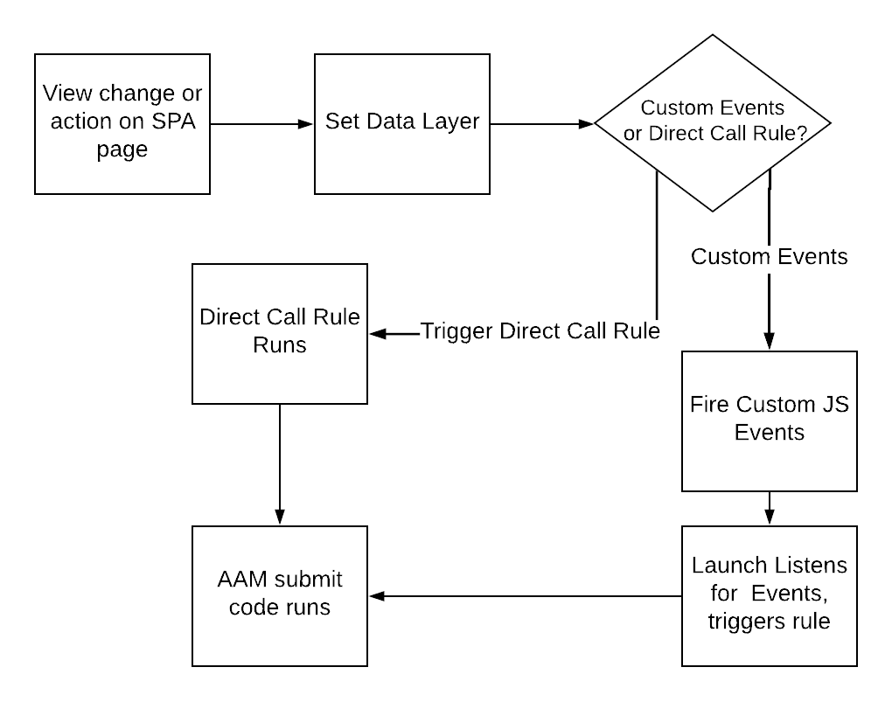

# Utilizza le best practice sulle SPA pagine quando invii dati a AAM {#using-best-practices-on-spa-pages-when-sending-data-to-aam}

Questo documento descrive diverse best practice per l’invio di dati da applicazioni a pagina singola (SPA) a Adobe Audience Manager (AAM). Questo articolo si concentra sull&#39;utilizzo [!UICONTROL Experience Platform tags], il metodo di implementazione consigliato.

## Note iniziali

* Gli elementi seguenti presupporranno l’utilizzo di tag Platform per l’implementazione sul sito. Le considerazioni esistono ancora se non utilizzi i tag Platform, ma dovrai adattarli al metodo di implementazione.
* Tutte le SPA sono diverse, pertanto potrebbe essere necessario modificare alcuni dei seguenti elementi per soddisfare al meglio le tue esigenze, ma Adobe vuole condividere alcune best practice alle quali devi pensare quando invii dati da SPA pagine all’Audience Manager.

## Diagramma semplice dell’utilizzo di SPA e AAM nei tag di Experience Platform (precedentemente Launch){#simple-diagram-of-working-with-spas-and-aam-in-experience-platform-launch}

>[!NOTE]
>Come indicato, questo è un diagramma semplificato del modo in cui SPA pagine vengono gestite in un’implementazione Adobe Audience Manager (senza Adobe Analytics) utilizzando i tag di Platform. Come puoi vedere, è abbastanza semplice, e la decisione principale è quella di comunicare una modifica della visualizzazione (o un’azione) ai tag Platform.

## Attivazione di tag dalla pagina SPA {#triggering-launch-from-the-spa-page}

Due dei metodi più comuni per attivare una regola nei tag di Platform (e quindi inviare dati ad Audience Manager) sono:

* Impostazione di eventi personalizzati JavaScript (vedi esempio [QUI](https://helpx.adobe.com/analytics/kt/using/spa-analytics-best-practices-feature-video-use.html) con Adobe Analytics)
* Utilizzo di un [!UICONTROL Direct Call Rule]

In questo Audience Manager, utilizzi un [!UICONTROL Direct Call rule] in Tag della piattaforma per attivare l’hit che entra in Audience Manager. Come vedrai nelle sezioni successive, questo risulta utile impostando il [!UICONTROL Data Layer] a un nuovo valore, in modo che possa essere rilevato dal [!UICONTROL Data Element] nei tag della piattaforma.

## Pagina demo {#demo-page}

Questa è una piccola pagina che dimostra come modificare un valore nel livello dati e inviarlo ad Audience Manager, come puoi fare in una pagina SPA. Questa funzionalità può essere modellata per apportare modifiche più elaborate necessarie. È possibile trovare questa pagina demo [QUI](https://aam.enablementadobe.com/SPA-Launch.html).

## Impostazione del livello dati {#setting-the-data-layer}

Come accennato, quando un nuovo contenuto viene caricato sulla pagina o quando un utente esegue un’azione sul sito, il livello dati deve essere impostato dinamicamente nell’intestazione della pagina PRIMA che i tag Platform siano chiamati ed esegua il [!UICONTROL rules], in modo che i tag Platform possano raccogliere i nuovi valori dal livello dati e inviarli all’Audience Manager.

Se visiti il sito demo elencato sopra e osserva la sorgente della pagina, vedrai:

* Il livello dati si trova nella parte superiore della pagina, prima della chiamata ai tag di Platform
* Il codice JavaScript nel collegamento SPA simulato cambia il [!UICONTROL Data Layer], quindi chiama i tag Platform (il `_satellite.track()` chiamare). Se utilizzi eventi personalizzati JavaScript invece di questo [!UICONTROL Direct Call Rule], la lezione è la stessa. Per prima cosa, modifica [!DNL data layer], quindi chiama i tag Platform .

>[!VIDEO](https://video.tv.adobe.com/v/23322/?quality=12)

## Risorse aggiuntive {#additional-resources}

* [SPA discussione sui forum Adobi](https://forums.adobe.com/thread/2451022)
* [Siti dell’architettura di riferimento per mostrare come implementare SPA nei tag di Platform](https://helpx.adobe.com/experience-manager/kt/integration/using/launch-reference-architecture-SPA-tutorial-implement.html)
* [Utilizzo delle best practice per il tracciamento dei SPA in Adobe Analytics](https://helpx.adobe.com/analytics/kt/using/spa-analytics-best-practices-feature-video-use.html)
* [Sito demo utilizzato per questo articolo](https://aam.enablementadobe.com/SPA-Launch.html)
